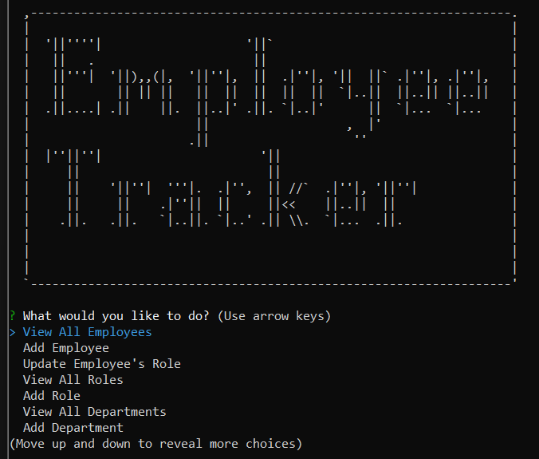

# Employee Tracker With SQL

## Description

This application provides the user with an employee tracking tool. It runs in node and uses mySQL to store, manipulate, and retrieve the data about the user's organization.

The user is able to create, view, and delete employees, roles, and departments. They are also able to update employees to give them new roles or managers. Additional views of the organizational data are available to the user. They are able to view the total count of employees by manager or department, as well as the total employee salary within each department.

---

## Table of Contents

- [Installation](#installation)
- [Usage](#usage)
- [Tests](#tests)
- [Demo](#demo)
- [License](#license)
- [Questions](#questions)

---

## Installation

To install this application, download all of the files from the repository to a local directory on your machine. The application was built on node.js v16.14.2, and a compatible installation of node.js is required to use the application.

After downloading all of the files from the repository, your mySQL user name and password need to be coded into the object inside of the createConnection method in the /config/connection.js file (`const db = sql.createConnection()`). The database configuration is in the /db/schema.sql file, and example data for the tables is in the /db/seeds.sql file. Each of these should be run from a mySQL interface to establish the database and populate it with data.

From the terminal, run `npm i` to install all dependencies from the package.json.

---

## Usage

After the above installation steps are complete, the application is ready to use. To use the application, from the terminal run `node index.js`.

---

## Tests

No test scripts were developed for this application.

---

## Demo

A demonstration of the deployed application is at the following YouTube link:
[Employee Tracker with SQL Demo](https://www.youtube.com/watch?v=HqCIeKlcKzo)

A screenshot of the application is below:

---

## License

This project is licensed under a [MIT License](https://opensource.org/licenses/MIT).

---

## Questions

Check out my [GitHub profile](https://github.com/aavillanueva6).

For additional questions about this project, please reach out to me at <aavillanueva6@gmail.com>
